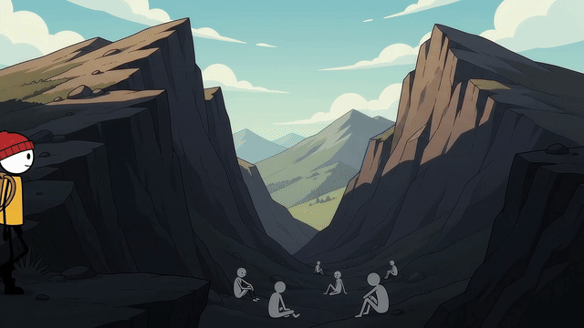
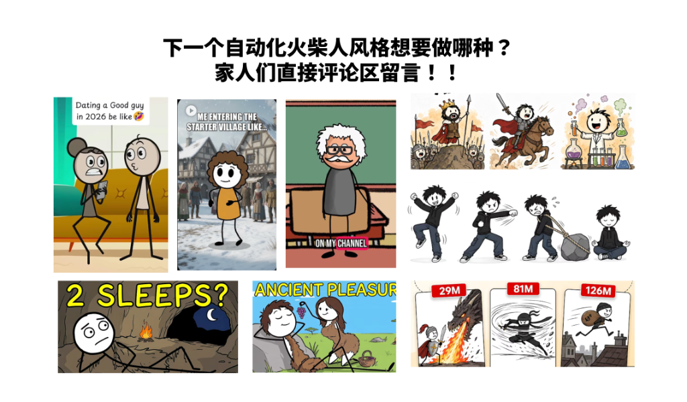

<!-- readme:hero -->

<div align="center">

[**简体中文**](README.md) · [English](README.en.md) · [日本語](README.ja.md) · [한국어](README.ko.md) · [Português do Brasil](README.pt-BR.md)

# Stickman Video Director

### 把任何想法，变成一支真正“动起来”的一分钟火柴人视频。

一个 Codex Skill，就能把你的文案变成经过确认的英文旁白、以画面为先的导演提案，以及六条可直接生产的 Gemini Omni Flash 提示词。


适合制作发布在 **YouTube Shorts、TikTok、Instagram Reels 和 YouTube** 上的知识解释、励志故事、教育短片与快节奏视觉内容。

</div>

<!-- readme:demos -->

## 视觉流派体系与实机效果演示

> 点击任一动图预览，即可直接打开带声音的完整 10 秒高清视频演示。如果这些画风对你的创作有所启发，欢迎给仓库点一个 Star！

### 风格 1：基础黑白风 (Basic Minimalist)

最纯粹的高对比极简火柴人。无面部五官、无复杂服饰，利用高反差线条与关键饱和强调色穿透认知。最适合严肃硬核知识、逻辑拆解与思维模型。

| 风格 1A：白底黑人 (Light Mode) | 风格 1B：黑底白人 (Dark Mode) |
|:---:|:---:|
| <!-- demo:light:start --><a href="assets/readme/light-theme-demo.mp4"></a><!-- demo:light:end --> | <!-- demo:dark:start --><a href="assets/readme/dark-theme-demo.mp4"></a><!-- demo:dark:end --> |
| 白色画布 · 黑色线条人物 | 黑色画布 · 白色线条人物 |

---

### 风格 2：现代潮酷风 (Modern Beanie Zeke)

拥有鲜明人设 DNA（红冷帽 + 黄 T 恤 + 黑色简约线条身体）的现代 2D 动效火柴人。实测彻底解决了眼眶异化、毛球变形与肢体抽搐等痛点，画面极其丝滑。

| 风格 2A：极简科技 (Studio Tech) | 风格 2B：彩色故事 (Cinematic Story) |
|:---:|:---:|
| <a href="assets/readme/style-2a-demo.mp4"></a> | <a href="assets/readme/style-2b-demo.mp4"></a> |
| 纯白空间 · 极淡网格 · 青蓝微光 | 全彩沉浸 · 电影光影 · 叙事氛围 |

- **风格 2A：极简科技 (Studio Tech)**：纯白高光空间 + 极淡浅灰透视地砖网格 + 悬浮青蓝半透明玻璃 UI/微光质感（Apple Keynote 级极简科技感，内置反杂乱负面提示词）。
- **风格 2B：彩色故事 (Cinematic Story)**：全彩沉浸式场景（暖光卧室、黄昏窗前、荒野公路、云端山顶）+ 电影叙事光影（Pixar 故事短片风，角色始终保持干净 2D 线条）。

---

### 长期演进计划：打造火柴人全画风导演库

这是我致力于把**全网所有高转化火柴人画风**全部工业化、自动化做进来的长期开源合集。

<div align="center">
  
</div>

我这边已经系统梳理了将近 **10 种覆盖各大垂直赛道**的特色画风。如果评论区与社区反馈热烈，我接下来会保持**每 3~4 天持续更新上线一个新风格**：

1. **风格 3：情景喜剧 / 双人对话风** —— 双角色互动、情感互怼、职场嘴替与日常吐槽
2. **风格 4：2D 火柴人融入写实 3D 背景** —— 虚实次元碰撞、RPG 新手村冒险、奇幻穿越
3. **风格 5：讲台名师 / 科普脱口秀风** —— 黑板教具互动、学者解说、严肃知识通俗化
4. **风格 6：手绘绘本 / 骑士冒险风** —— 治愈成长手绘、古典寓言、温暖儿童科普
5. **风格 7：热血涂鸦 / 武斗打戏风** —— 极简高燃动作分镜、连招对决、打击力量感
6. **风格 8：史前洞穴 / 黑色幽默风** —— 历史反差萌、远古人类脑洞、趣味反转神剧
7. **风格 9：爆款卡牌 / 闯关游戏风** —— 数值爽感爆发、升级进阶、解说与游戏推文

#### 接下来我会持续升级的三大方向：
1. **全画风矩阵覆盖**：火柴人还有很多画风，我争取把上图中的各种爆款画风全部做进来，让所有赛道的创作者都能直接拿来用；
2. **彻底解决优质内容来源**：不是简单给一个提示词让 AI 瞎编，而是要基于全网各种内容爆款进行抓取、汇总和分类，并提供针对性的爆款改编方案；
3. **独立 Web 影像工作台**：因为风格越来越多，光靠 skill 形式肯定不够方便。我计划做一个网站去承载，方便大家直接在线预览效果、匹配爆款文案并一键导出提示词。

---

## 有文案，不等于已经有了视频

一个好想法仍然可能生成一段平淡的动画：一个人物、一个背景，十秒钟里几乎没有新的视觉变化。真正导演完整的一分钟，需要设计开场钩子、控制解释节奏、创造贴合内容的视觉隐喻、推动镜头、连接场景，并在多次独立生成之间锁住一致性。

**Stickman Video Director 会在你消耗生成额度之前，先完成这些制作层面的思考。**

<!-- readme:advantages -->

## 为什么短视频创作者会需要这个 Skill

| 优势 | 你会得到什么 |
|---|---|
| **更强的故事结构** | 在保留核心含义的前提下，把原始材料重组成强开场、递进解释和结尾回扣。 |
| **真正的确认节点** | 先展示清晰可读的六幕导演提案，再生成最终模型提示词；在修改成本最低的时候调整故事。 |
| **丰富且相关的动态画面** | 每段规划三个时间节拍，并加入视觉隐喻、环境变化、镜头运动、文字节点、人物互动、转场、BGM 与音效。 |
| **完整的生产锁定** | 在每条独立提示词中重复人物、线条粗细、配色、声音、台词、音频、转场和负面约束。 |
| **真正适配画幅的导演方式** | 针对 `9:16`、`16:9` 或 `1:1` 重新设计构图、镜头路径和文字位置，而不是只替换一个比例标签。 |
| **可控的视觉反差** | 支持白底黑人、黑底白人，以及最多三种高饱和强调色。 |
| **忠于原始材料** | 不随意编造缺乏依据的事实、数据、引语或产品卖点。 |

无需 API，也不依赖 MCP。安装 Skill、调用它，然后在对话中完成整个制作流程即可。

<!-- readme:platforms -->

## 同一个想法，为不同屏幕重新构图

| 比例 | 适合场景 | 导演重点 |
|---|---|---|
| `9:16` | YouTube Shorts、TikTok、Instagram Reels | 纵向纵深、醒目的中央轮廓、层叠式揭示、适合手机阅读的文字 |
| `16:9` | YouTube 知识视频、教育内容、视觉随笔 | 横向调度、侧向镜头运动、分屏对比、充足的负空间 |
| `1:1` | 社交平台信息流、紧凑的产品故事 | 强中心构图、放射式运动、清晰的边缘留白 |

<!-- readme:workflow -->

## 粘贴 → 选择 → 确认 → 生成 → 拼接

1. **粘贴**文案、笔记、文章，或者只给出一个主题。
2. **选择** `16:9`、`9:16` 或 `1:1`，再选择画风（风格 1 基础黑白、风格 2A 极简科技、风格 2B 彩色故事，或更多规划风格）。
3. **确认**包含英文 VO、参考翻译、画面、镜头、转场、BGM 和音效的详细导演提案。
4. **生成**当前提案获批后的六条独立 Gemini Omni Flash 提示词。
5. **拼接**六段约十秒的视频，组成一支连贯的一分钟成片。

画幅、风格、主题、旁白、场景结构、配色、声音或基调都可以修改。发生全局变化时，Skill 会回到提案阶段并重新请求确认。

<!-- readme:output -->

## 最终会得到什么

- 面向创作者的英文标题、核心观点、开场钩子、基调、配色、声音与音乐方向
- 约 **130–150 个英文单词**的一分钟旁白
- 六个彼此不同的画面场景，每两到三秒出现一次明显变化
- 精确英文台词与参考翻译
- 六条带时间节拍和负面约束的独立 Gemini Omni Flash 提示词
- 前后匹配的结尾与开场，让片段之间更容易衔接
- BGM、音效、一致性和最终拼接建议

<details>
<summary><strong>示例请求</strong></summary>

```text
Use $directing-stickman-videos to turn this copy into a one-minute English stickman video:

Gravity bends space and time so strongly around a black hole that even light cannot escape.
```

Skill 会先询问缺失的画幅和风格主题，然后展示六幕导演提案供你确认，确认前不会生成最终模型提示词。

</details>

## 💡 零门槛跑通：超低成本上手 Gemini Omni Flash

很多刚接触 AI 视频的朋友常问：“生成出来的提示词怎么用？跑视频会不会很贵？”

**答案是：几乎零成本，完全足够支撑日常日更！**

Gemini Omni Flash 凭借极强的上下文连贯性和角色一致性，目前已登顶 LMSYS 文生视频评测榜首。在官方平台 **Google Flow** (`https://labs.google/fx/tools/flow`) 中：
- **单条视频仅消耗约 15 积分**：每条 10 秒 720P 视频极速生成；
- **每月 1,000 积分白送**：开通 Google AI Pro 会员后，每月赠送的积分可直接生成 60+ 条 10 秒视频片段；
- **几块钱极速上车**：官方订阅原本为 $19.99/月，目前通过海外运营商合作活动渠道（在闲鱼等平台搜索 “Gemini Pro 18个月”，几块钱即可搞定），即可在 Google Flow 畅玩顶级视频生成与无限生图；
- **速通实操全教程**：想要了解完整的 Flow 设置与上车姿势，推荐阅读烤妹儿的实操指引推文：[《白嫖谷歌！7 块钱解锁 18 个月 Pro：无限 Nano Banana 生图 ＋ 登顶第一的视频模型（附 Flow 速通全攻略）》](https://x.com/CrazyKaomei/status/2093893997223923822?s=20)。

<!-- readme:install -->

## 安装

克隆仓库：

```bash
git clone https://github.com/kaomei/stickman-video-director.git
cd stickman-video-director
```

把可安装的 Skill 文件夹复制到 Codex skills 目录：

```bash
cp -R skills/directing-stickman-videos "${CODEX_HOME:-$HOME/.codex}/skills/"
```

重启 Codex，让 Skill 出现在可用列表中。然后调用它并粘贴你的素材：

```text
$directing-stickman-videos
```

<!-- readme:reliability -->

## 为反复修改而设计，也诚实面对生成差异

- **确认必须明确。** 当前提案没有得到批准前，不会进入 Phase B。
- **全局变化会触发重新构图。** 新画幅、新风格或新主题会重新设计导演提案，而不是机械替换文字。
- **提示词可以独立使用。** 每条都会重复独立生成所需的关键锁定条件。
- **内容始终有依据。** Skill 可以强化结构与表达，但不会添加没有来源的主张。
- **音频仍可能存在差异。** 独立生成的视频可能出现轻微的声音或音乐差别。追求最高一致性时，可以保留每段同步音效，并在拼接时使用一条连续的外部旁白和 BGM。

## 仓库结构

```text
skills/directing-stickman-videos/  可安装的 Skill
assets/readme/                     README 演示素材与风格路线图
tests/                             行为场景与验证脚本
docs/superpowers/specs/            已确认的产品设计
docs/superpowers/plans/            实施计划
```

<!-- readme:contribute -->

## 一起把它做得更好

欢迎提交使用案例、提示词改进、真实生成记录与具体建议。你可以创建 issue，或者通过 pull request 提交一个范围明确、能够复现的改动。

如果你对路线图中的某个画风特别感兴趣，**欢迎在 Issue 中留言或 Star 仓库**。这会直接决定我下一次优先更新哪种火柴人风格！

## 许可证

MIT
